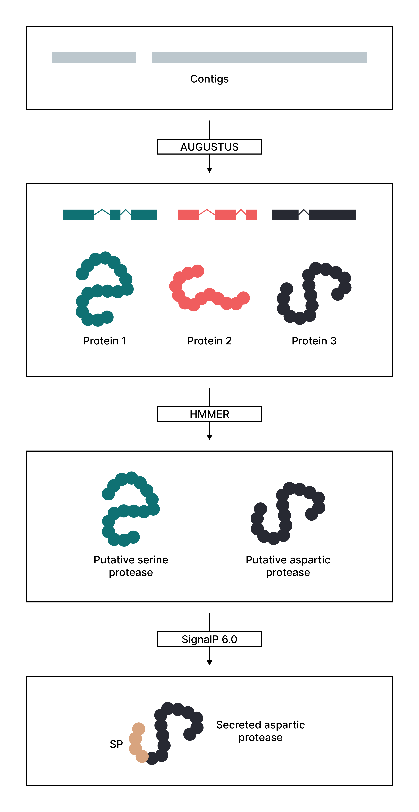

- [AUGUSTUS](#augustus)
- [HMMER](#hmmer)
- [SignalP](#signalp)



```bash
# Filter short contigs
bioawk -c fastx '{if (length($seq) >= 1000) print ">"$name"\n"$seq}' scaffolds.fasta > scaffolds_min1000.fasta
```

# AUGUSTUS
```bash
augustus --genemodel=complete --species=SPECIES contigs.fna > genes.gff
```

```bash
perl getAnnoFasta.pl genes.gff
mv genes.aa predicted_proteins.faa
```

# HMMER
```bash
python predict_proteases.py merops.hmm predicted_proteins.faa
```

# SignalP
```bash
signalp6 -ff predicted_proteases.faa -od signalp_results/ -fmt none -org euk -m slow
```
